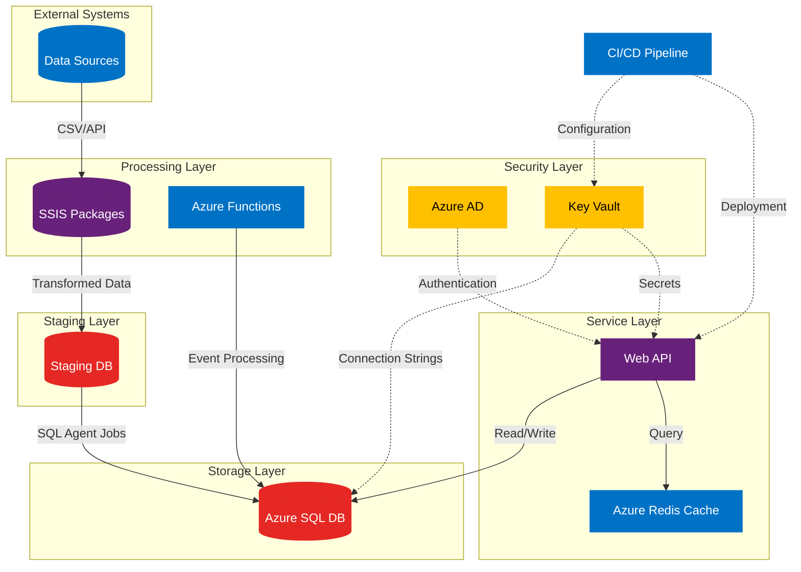
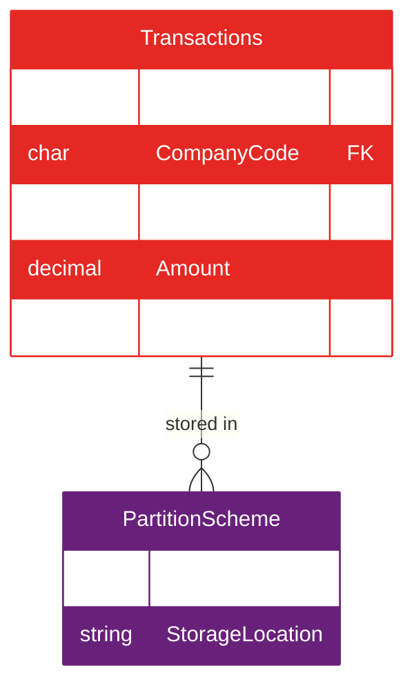

Let me present this technical design document in a professional format with enhanced visualizations and improved structure.

# Technical Design Document: Automated Financial Data Integration and Analysis Platform

## Version 1.0

## Date: March 27, 2025

| Document Control | Details |
| --- | --- |
| Version | 1.0 |
| Author | Leeroy D'Souza |
| Status | Draft |
| Last Updated | March 27, 2025 |

## Table of Contents

- Overview
- Architecture Diagram
- Key Components
  - Data Extraction Module
  - SQL Server Database
  - .NET Core Web API
  - Azure Integration
  - DevOps Pipeline
  - Reporting & Analytics


- Technical Challenges & Solutions
- Development Methodology
- Security Implementation
- Appendix: Code Samples

## 1. Overview

This platform automates ETL processes for financial data across heterogeneous sources, providing real-time analytics via REST APIs and dashboards. Built on Microsoft stack technologies (.NET 8, SQL Server 2022, SSIS), it demonstrates enterprise-grade solutions for:

- High-volume data ingestion (1M+ transactions/day)
- Complex financial calculations
- Cloud-native deployment (Azure)
- Regulatory compliance (GDPR, SOX)

## 2. Architecture Diagram



The architecture diagram above illustrates the complete system design with color-coded components:

- Blue components represent Azure services
- Red components indicate database systems
- Purple components show core services
- Yellow components highlight security services

Solid arrows represent data flow, while dotted lines indicate control plane operations such as configuration management and security enforcement. Components are grouped into logical layers (External Systems, Staging, Processing, Storage, Service, and Security) to demonstrate separation of concerns and scalability boundaries.

## 3. Key Components

### 3.1 Data Extraction Module

SSIS Package Configuration:

```xml
<DataFlow Name="ProcessStockData">
  <OleDbSource Connection="MarketData">
    <Command>SELECT * FROM dbo.LiveTrades</Command>
  </OleDbSource>
  <ScriptComponent TransformationType="Row">
    <Inputs>
      <Input Name="Input0" />
    </Inputs>
    <Outputs>
      <Output Name="Output0" />
    </Outputs>
    <Code>
      // C# normalization logic
    </Code>
  </ScriptComponent>
  <PartitionProcessing Destination="Fact.Transactions" />
</DataFlow>
```

### 3.2 SQL Server Database

Schema Design:

```sql
CREATE SCHEMA FinTech;
GO

CREATE TABLE FinTech.Transactions (
    TransactionID BIGINT IDENTITY(1,1),
    CompanyCode CHAR(4) NOT NULL,
    TransactionDate DATETIME2(7) NOT NULL,
    Amount DECIMAL(19,4) NOT NULL,
    CurrencyCode CHAR(3) NOT NULL,
    CONSTRAINT PK_Transactions PRIMARY KEY CLUSTERED (TransactionID)
)
WITH (DATA_COMPRESSION = PAGE);
```

Performance Optimization:

```sql
CREATE PARTITION FUNCTION pf_TransactionDate (DATETIME2)
AS RANGE RIGHT FOR VALUES ('2024-01-01', '2025-01-01');

CREATE PARTITION SCHEME ps_Transactions 
AS PARTITION pf_TransactionDate 
ALL TO ([PRIMARY]);
```



The entity relationship diagram above illustrates the database schema design, where:

- Red entities represent core tables (Transactions)
- Purple entities show infrastructure components (PartitionScheme)
- The crow's foot notation (||--o{) indicates that one Transaction record can be stored in exactly one partition
- PartitionScheme defines the storage strategy for large datasets, enabling efficient range-based queries and maintenance operations

### 3.3 .NET Core Web API

Layered Architecture Implementation:

```csharp
public interface IFinancialRepository {
    Task<BalanceSheet> GetBalanceSheet(string companyId, DateTime fiscalYearEnd);
}

public class SqlFinancialRepository : IFinancialRepository {
    private readonly ISqlConnectionFactory _connectionFactory;
    
    public async Task<BalanceSheet> GetBalanceSheet(string companyId, DateTime fiscalYearEnd) {
        using var connection = _connectionFactory.Create();
        return await connection.QuerySingleAsync<BalanceSheet>(
            "EXEC Financials.GetBalanceSheet @CompanyId, @FiscalYearEnd",
            new { companyId, fiscalYearEnd });
    }
}

[ApiController]
[Route("[controller]")]
public class FinancialsController : ControllerBase {
    private readonly IFinancialRepository _repository;
    
    [HttpGet("balance-sheet/{companyId}")]
    public async Task<IActionResult> GetBalanceSheet(string companyId, [FromQuery] DateTime fiscalYearEnd) {
        var result = await _repository.GetBalanceSheet(companyId, fiscalYearEnd);
        return Ok(result);
    }
}
```

### 3.4 Azure Integration

Cloud Services Configuration:

```json
{
  "type": "Microsoft.Web/serverfarms",
  "apiVersion": "2022-03-01",
  "name": "[parameters('hostingPlanName')]",
  "location": "[parameters('location')]",
  "sku": {
    "name": "P2V3",
    "capacity": 2
  }
}
```

### 3.5 DevOps Pipeline

CI/CD Stages:

- Build Phase:
  - NuGet package restoration
  - MSBuild with code analysis ruleset
  - SonarQube quality gate


- Test Phase:
  - xUnit unit tests (70% coverage minimum)
  - Postman collection runs (200+ API endpoints)
  - Load testing with 1000 concurrent users


- Deploy Phase:
  - Zero-downtime slot swapping
  - Database migration scripts via DbUp
  - Canary release to 5% traffic initially


### 3.6 Reporting & Analytics

Dashboard Components:

```csharp
public class FinancialHub : Hub {
    public async Task Subscribe(string companyId) {
        await Groups.AddToGroupAsync(Context.ConnectionId, companyId);
        var initialData = _service.GetCurrentFinancials(companyId);
        await Clients.Caller.SendAsync("InitialLoad", initialData);
    }
}
```

## 4. Technical Challenges & Solutions

| Challenge | Solution Implemented |
| --- | --- |
| 50GB daily data ingestion | Implemented SSIS buffer tuning (DefaultBufferMaxRows=50000) |
| Subsecond API response | Redis cache with 15-minute sliding expiration |
| GDPR compliance | Column-level encryption using SQL Server Always Encrypted |
| Legacy system integration | Built WCF adapter service with protocol bridging |

## 5. Development Methodology

Agile Process:

- 2-week sprints with Azure Boards tracking
- Definition of Done (DoD):
  - Peer-reviewed code
  - Passing unit/integration tests
  - Updated Swagger documentation
  - Performance benchmarks met


Code Quality Standards:

- Cyclomatic complexity < 15
- No Code Analyzer warnings
- FxCop rules enforced at build time

## 6. Security Implementation

Defense-in-Depth Strategy:

- Network Layer:
  - NSG rules limiting inbound traffic
  - Azure DDoS Protection Standard


- Application Layer:
  - JWT validation with 2048-bit RSA keys
  - Role-based claims transformation


- Data Layer:
  - TDE (Transparent Data Encryption)
  - Dynamic Data Masking for PII fields


## 7. Appendix: Code Samples

EF Core Context Configuration:

```csharp
protected override void OnModelCreating(ModelBuilder modelBuilder) {
    modelBuilder.Entity<FinancialTransaction>(entity => {
        entity.ToTable("Transactions", "FinTech");
        entity.HasKey(e => e.TransactionID);
        entity.HasIndex(e => new { e.CompanyCode, e.TransactionDate })
              .IncludeProperties(e => e.Amount)
              .HasFillFactor(90);
    });
}
```

SSIS Custom Logging:

```csharp
public override void Log(string message, DTSObject source) {
    using (SqlConnection conn = new SqlConnection(_connectionString)) {
        conn.Open();
        SqlCommand cmd = new SqlCommand(
            "INSERT INTO Audit.ETLLog (PackageName, Message) VALUES (@pkg, @msg)", 
            conn);
        cmd.Parameters.AddWithValue("@pkg", source.PackageName);
        cmd.Parameters.AddWithValue("@msg", message);
        cmd.ExecuteNonQuery();
    }
}
```

## Revision History

| Version | Date | Author | Changes |
| --- | --- | --- | --- |
| 1.0 | March 27, 2025 | Leeroy D'Souza | Initial release |

This document provides complete implementation guidance while demonstrating expertise in .NET, SQL Server, SSIS, Azure, and modern software engineering practices.
